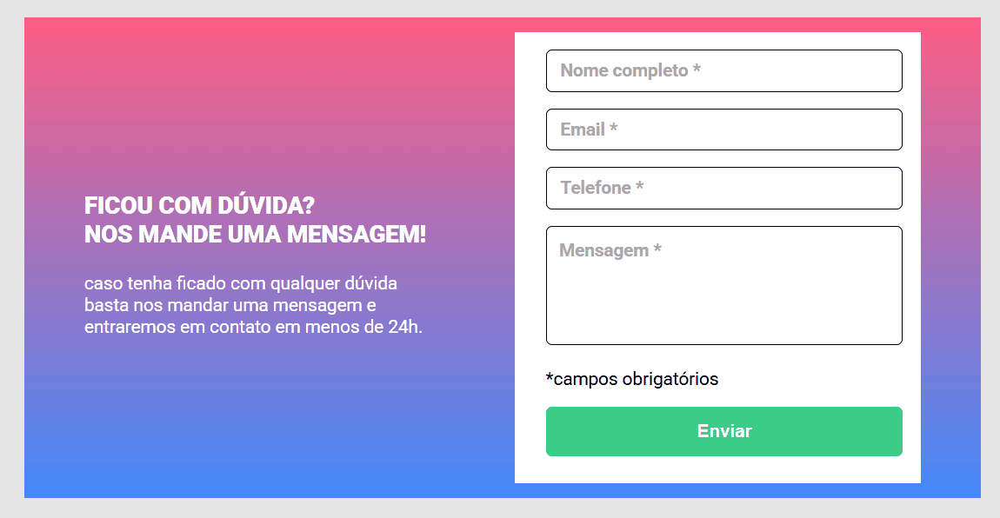

# Quest de HTML, CSS e JavaScript

Este repositório contém o projeto desenvolvido como parte de uma quest do curso **Dev em Dobro**, no nível intermediário de JavaScript. O objetivo principal foi criar um formulário funcional e estilizado, consolidando conhecimentos em **HTML**, **CSS** e **JavaScript**.

## Objetivo

Este projeto foi criado para:
- Testar a manipulação do DOM com JavaScript.
- Desenvolver validações visuais e funcionais de formulários.
- Aplicar boas práticas de estruturação com HTML e CSS.

### Demonstração do Projeto
Aqui está um gif mostrando o funcionamento do projeto:

## Tecnologias Utilizadas

- **HTML5**: Estruturação do conteúdo.
- **CSS3**: Estilização da página, incluindo:
  - Validação visual com bordas nos campos do formulário.
- **JavaScript**: Validação e interatividade no formulário.

## Estrutura do Projeto

- `index.html`: Arquivo principal com a estrutura da página.
- `style.css`: Estilos principais para o design do formulário.
- `reset.css`: Reset CSS para padronizar os estilos.
- `index.js`: Lógica de validação do formulário.
- `imagens/bg-repeat.jpg`: Imagem utilizada como plano de fundo.

## Funcionalidades

- Exibição de mensagens de erro ao deixar campos obrigatórios em branco.
- Validação visual com bordas vermelhas para campos inválidos e verdes para campos válidos.

## O que Aprendi

- Manipulação de DOM e Laços com JavaScript.
- Implementação de validações em formulários.
- Estruturação de projetos front-end organizados.
- Criação de layouts responsivos com CSS.

## Licença

Este projeto está sob a licença MIT. Sinta-se à vontade para utilizá-lo e adaptá-lo!

## 💡 Contribuições e Melhorias

Estou sempre em busca de aprender e melhorar. Se você tiver sugestões, ideias ou encontrar algo que possa ser ajustado no código, fique à vontade para compartilhar! Sua contribuição será muito bem-vinda. 😊